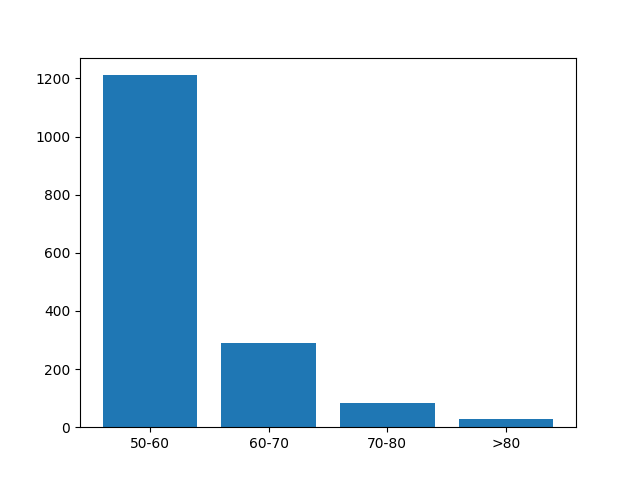
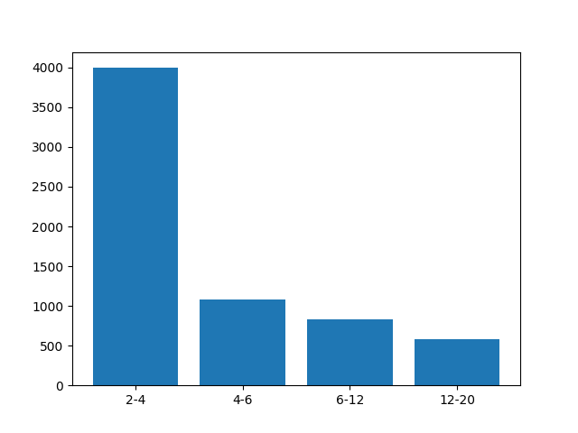

Paczka analizująca ruch autobusów ZTM Warszawy
=====================


## Paczka (opis)

Głównymi trzema funkcjami w paczce jest pobieranie danych z API warszawskiego ZTM, analiza danych oraz wizualizacja ich na mapie z pomocą paczki 'folium'.

## Zastosowanie

0. Pobranie paczki

Wszystkie działania wykonujemy przy pomocy pomocniczego skryptu parser.py z odpowiednimy argumentami.

1. Pobieranie danych

1.1. Rekordy autobusów

```comandline
parser.py --akcja pobierz_autobusy --plik <ścieżka_pliku_wyjściowego> --start <data rozpoczecia> --koniec <data zakończenia> --api_key <APIkey>
```
Argumenty plik i api_key są opcjonalne (api_key domyślnie ustawiony jest na autora). Argumenty start i koniec są konieczne.

1.2 Dane przystanków

```comandline
parser.py --akcja pobierz_przystanki --plik <ścieżka_pliku_wyjściowego> --api_key <APIkey>
```
Argumenty jak wyżej opcjonalne.

1.3. Dane rozkładów jazdy
```comandline
parser.py --akcja pobierz_rozklady --plik <ścieżka_pliku_wyjściowego> --api_key <APIkey> --danePrzystankow <sciezka>
```
Argumenty jak wyżej opcjonalne.

2. Analiza danych

2.1 Analiza prędkości

```comandline
parser.py --akcja analizuj_predkosci --plik <ścieżka_pliku_wyjściowego> --daneBusow <ścieżka_pliku_z_danymi> --start <czas_rozpoczecia_pobierania_danych> --end <czas_zakonczenia_pobierania_danych>
```
Argument daneBusow jest opcjonalny - domyślnie ustawiony na domyślną lokalizację zapisu rekordów Autobusów. Argumenty start i koniec są konieczne.

2.2 Analiza opóźnień
```comandline
parser.py --akcja analizuj_opoznienia --plik <ścieżka_pliku_wyjściowego> --daneBusow <ścieżka> --danePrzystankow <sciezka> --daneJazdy <sciezka> --start <data> --koniec <data> --data <data>
```
Argumenty start, koniec i data są konieczne. Data jest datą (rok, miesiąc, dzień) pobierania rekordów autobusów. Reszta opcjonalna.

3. Wizualizacja

3.1. Wizualizacja prędkości
```comandline
parser.py --akcja pokaz_predkosci --predkosc <sciezka_do_pliku_z_analiza>
```
Argumenty opcjonalne

3.2. Wizualizacja opóźnień
```comandline
parser.py --akcja pokaz_opoznienia --opoznienia <sciezka_do_pliku_z_analiza>
```
Argumenty opcjonalne

## Uwagi projektowe

- Pobieranie danych (głównie rozkładów jazdy 1.3.) zajmuje bardzo długo, więc zaleca się odpalenie w tle.
- W przypadku nieotrzymania żądanych danych, dane żądanie powtarza się kilka razy. Jeżeli i w tej sytuacji nie otrzyma się żądania, podnoszony jest wyjątek lub w wypadku kolejnych żądań wypisywana jest informacja na standardowe wyjście.
- Argumenty start, koniec i data są niezbędne do poprawnego działania programów. Zaleca się korzystanie z domyślnych ścieżek plików. Mogą być w formacie datetime.
- W analizie prędkości grupujemy rekordy autobusów po ich numerach id i symulujemy ich ruch, po krzywej łamanej przez punkty, w których się znalazły. Pomiędzy dwoma kolejnymi punktami autobus porusza się ruchem jednostajnym, a w wizualizacji zaznacza się środek tego odcinka.
- Błędne rekordy jak spoza czasu pobierania lub w bardzo dalekiej odległości odrzucamy.
- W analizie opóźnień szacujemy (jeśli się da) dla każdego planowanego przyjazdu rzeczywisty dojazd autobusu. Znajdujemy najbliższy rekord autobusu, a następnie w zależności od odległości od przystanku szacujemy liniowo czas dojazdu.
- W wizualizacji korzystam z biblioteki 'folium' do zaznaczania na mapie wyznaczonych danych. Wynikiem jest mapa w formacie .html dzięki czemu można swobodnie przybliżać i oddalać wyniki.

## Przykłady

W plikach znajdują się pliki z analizą autobusów z dnia 16.02.2024 r. w godzinach 9:00 - 10:00. Poniżej załączam wykresy, a mapy można otworzyć z pliku.

Wykres przekroczeń prędkości:



Wykres opóźnień autobusów:



## Testy + profiler

Uruchamiane jak wyżej parserem z komendami --akcja: testuj, wykonaj_Profile, pokaz_Profile